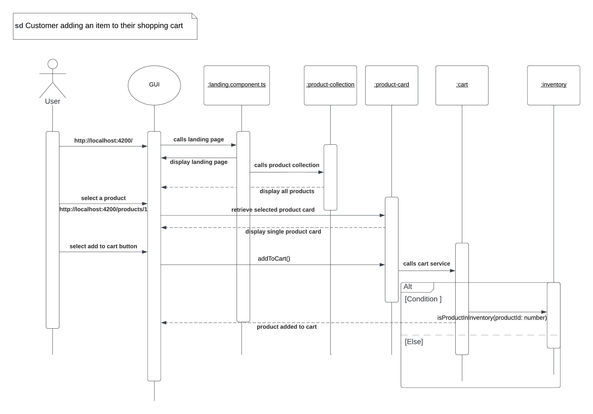
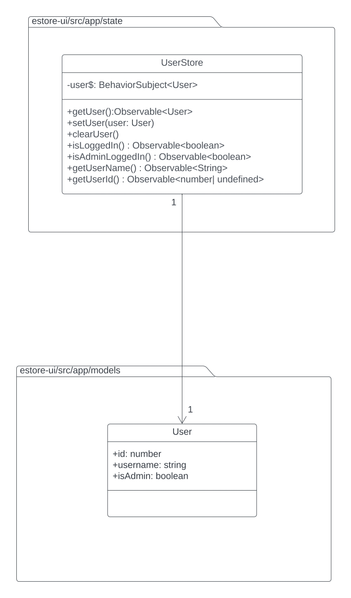
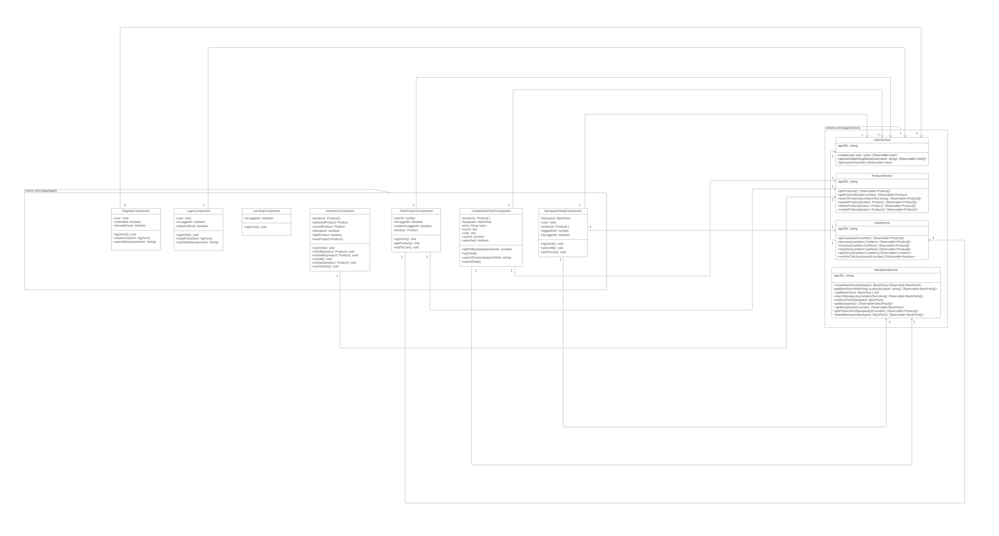

# PROJECT Design Documentation

## Team Information

- Team name: TEAM 1
- Team members
  - Sam Singh Anantha
  - Monoshiz Mahbub Khan
  - Vidit Naithani
  - Regina Afu
  - Utkarsh Sharma

## Executive Summary

Backpack is an online e-store that sells gear and equipment for outdoor adventures such us camping, biking, hiking, fishing and so on. Backpack is focused on providing quality gear to outdoor enthusiasts at the best prices, nothing more nothing less. Backpack helps you experience the transformational power of nature. We understand the simple joy of having the right clothing and gear work the way it is supposed to. So our purpose is to awaken a lifelong love of the outdoors, for all.

Backpack also provides the option for users to make a curated list of equipments used during an outdoor trip to a certain destination. Users who are not familiar with the gear needed for a certain trip can reference these curated lists and add them to their cart, this makes it easier for newbies to buy equipment based on their necessity. So whether you are new to the outdoors or a seasoned pro, we hope you'll choose us to enhance your outdoor experiences.

Backpack targets an audience of people who love fitness and outdoor adventures.

## Requirements

This section describes the features of the application.

### Definition of MVP

A minimum viable product is an early iteration of the product that provides a minimum number of essential features a customer can use. Additional features are built on top of the MVP features.

### MVP Features

**User Login**  
The user login feature enables the admin and customer to login so they can see the respective screens.

_Admin login_  
As an admin, I want to login through my username to Backpack so that I can access my dashboard to view orders and inventory.

_Customer login_  
As a customer, I want to login through my username to Backpack so that I can access member-only features.
**User Create Account**

- The create account feature enables a new user to create their account so they can login and access member-only features.

**Inventory Management**  
The Inventory Management feature provides a dashboard for the admin to keep track of their inventory.

- As an admin, I want to add new equipment to my inventory.
- As an admin, I want to remove equipment from my inventory.
- As an admin, I want to edit details the equipment.
- As an admin, I want to adjust quantity and price of equipment.

**Product search**  
The Product Search feature lets the customer browse through the catalogue.

- As a customer, I want to search for an equipment in the product catalogue.

**Landing Page**
This is the first Page a customer would see after Login. This page displays product catalogue.

- As a customer, I want to see a list of all the equipments in the product catalogue.

**Cart Management**
The cart management feature lets the customer manipulate the cart.

- As a customer, I want to add equipment to my cart.
- As a customer, I want to update the quantity of items in my cart.
- As a customer, I want to delete equipment from my cart
- As a customer, I want my cart data to be preserved, even when I close the tab.

### Roadmap of Enhancements

**Curated Equipment**

- As a customer, I want to create a list of curated equipment.
- As a customer, I want to modify a curated list I created.
- As a customer, I want to delete a curated list I created.
- As a customer, I want to search for curated lists.
- As a customer, I want to add items from a curated list to my cart.

## Application Domain

The domian on this application is E-commerce. It is an e-store application where one can buy or sell products and perform commercial transactions electronically on the internet. It is an application that provides a virtual store of a retailer which sells products over the internet.

## Domain Model Description

A Customer profile and an Admin profile both will have same attributes. Both the profiles will have username,id,password,email,Address,contact number and email. id, username and password will be mandatory fields.

An Admin would be able to add and remove products from the inventory. He can also search products in the inventory. Admin can also edit, create and delete a Product.

A Product has various attributes- id,name,description,price and quantity. All these attributes are created by the admin and can be edited by Admin at any time. The inventory is bascically a collection of products.

The Customer can also search products from the inventory. Customers also has access to shopping cart where they can add and save those products which they might buy in the future. Customers can also delete products from the shopping cart. The Shopping cart takes products from the inventory.

A customer can also create a list of products which is called 'backpack'. This is the 10% enhancement feature of this project. This list of products can be accessed by other customers on the platform. A customer creats a backpack for a particular location to do a particular activity. So the whole purpose of this list is that it will act a recommendation to the other customers who are planning to go on the same location to do the same activity.

A backpack is just like a shopping cart as it contains a list of products. A customer can have many backpacks but only one shopping cart. Along with the list of products the backpack also has some other important attributes such as location, description and activity.

A Customer can create Sale. The Sale is an event which occurs after the customer selects the products which are to be purchased and then checks-out from the shopping cart. It takes all the selected products from the shopping cart and then provides different options to pay. Each item in the sale is a product. It has all the attributs of the product except the quantity. Here the quantity will be the number of pieces that the customer wants to purchase and not the total number of pieces present in the inventory. Also each sale item will have the attribute total-price which depends on the selected quantity. The Sale will also have attributes such as date, time and total-price which will be the sum of the total-price of each sale line item present in the sale.

Each sale will be saved in the purchase history after the payment is made (even if you have chosen the cash on delivery option). Purchase history is the collection of sales.

## Architecture and Design

### Summary

The following Tiers/Layers model shows a high-level view of the webapp's architecture.

The e-store web application, is built using the Model–View–ViewModel (MVVM) architecture pattern.

The Model stores the application data objects including any functionality to provide persistance.

The View is the client-side SPA built with Angular utilizing HTML, CSS and TypeScript. The ViewModel provides RESTful APIs to the client (View) as well as any logic required to manipulate the data objects from the Model.

Both the ViewModel and Model are built using Java and Spring Framework. Details of the components within these tiers are supplied below.

### Overview of User Interface

This section describes the web interface flow; this is how the user views and interacts
with the e-store application.

The following are the web interface flows for a customer and an admin respectively:
Customer:

1. Registered Customer:
   - The customer lands on the home page.
   - Since the customer is already registered, the customer proceeds to login by clicking on the login button.
   - The customer is taken to the login page.
   - The cutomer enters their username and logs in to their account.
   - The customer is taken to their home page.
   - The customer can either a) Lookup a product using the search bar or b) Choose a product to view from the ones listed on the home page.
     a) The customer chooses to lookup a product using the search bar. - The customer enters a product name - The product appears on the page - The customer clicks on the producta and is taken to a new page displaying a larger image of the product along with its description and price - The customer adds the product to the cart using the "Add to cart" button - The customer clicks on the cart icon on the top of the page and is taken to the cart page - A list of items in the cart alongside their quantities and prices are shown - The customer can add and delete items in the cart. - The customer can checkout the items in the cart using the "Proceed to checkout" button on this page.
     b) The customer chooses a product to view from the ones listed on the home page - The customer clicks on a product from the set of products shown on their homepage. - Steps 2 through 8 are repeated from a)
   - The customer can logout once they are done shopping
2. New Customer :

- The customer lands on the home page.
- Since they are not registered, if they try to sign in with a username, they will be shown an error message.
- They click on the SignUp button on the home page to proceed to register as a customer.
- The provide a username to register with.
- They click on the "Register" button.
- If they enter a username already in use, they will receive the message: "This username already exists."
- The enter a username not in use and click on the "Register" button.
- They get a success message "Thank you for your registration".
- The return to the home page.
- They can follow the steps from the beginning to the end in 1. to begin shopping as a registered user.

Admin:

- The admin lands on the home page.
- They login as an admin using the "Login" button on the home page.
- Once logged in, they can either shop as a registered customer following the steps in 1. under "Customer", or manage their store's inventory.
- To manage the store's inventory, the admin selects the inventory option from the drop-down menu at the top of the page.
- Navigating to the inventory page, they can either edit a product (its name, quantity, price etc) or add or delete a product in the list of products.
- They can then return to the previous page if they want to shop or logout using the drop-down at the top of the page.

### View Tier

- The View Tier is implementd using the Angular framework and constitutes the front-end/client-side functionality of the app.
- It is composed of the landing page component, login component, register component, view-product component, inventory component, and cart-page component.
- Each of the components consist of four different types of files-

  1. .html file - which is used to design the overall UI of the component page.
  2. scss file- which is used to style the different UI elements (such as buttons, input text fields etc) of the component page.
  3. .ts file - which defines the dynamic functionality of the component page such as UI element interactions with the user and the app operations that follow.
  4. .spec.ts file- which are unit test files for the component source file.

### Sequence Diagram for creating a backpack

### Sequence Diagram for customer adding to cart

### ViewModel Tier

- It is implemented using the Spring framework.
- The ViewModel tier of an application following the MVVM architecture design pattern is composed of the Controller class which provides the REST API services to manage frontend - backend interactions in the app.
- Our app so far provides 3 controller classes: Product Controller, User Controller and Cart Controller to provde REST API services to operate the app inventory (Product Controller), user login and registration (User Controller) and user cart (Cart Controller).
- The Product Controller class defines the following methods to provide REST API services to manage the store inventory :

  1. getProducts() - to access the entire inventory
  2. getProduct() - to access a specific product using the product id
  3. updateProduct() - to edit an existing product in the inventory
  4. createProduct() - to add a new product to the inventory
  5. deleteProduct() - to delete a specific product from the inventory by providing the product id

- The User Controller class defines the following methods to provide REST API services to manage the store's users' information:

  1. getUsers() - to get a list of all the users registered in the store.
  2. getUser() - to access the details of a particular user
  3. updateUser() - to update the details of a particular user
  4. createUser() - to register a new user into the store
  5. deleteUser() - to close the account of a particular user in the store

- The Cart Controller class defines the following methods to provide REST API services to manage a user's cart:

1. getCart () - to access all the items in a user's cart an display them to a logged in user.
2. getCartItem () - to access the details of a particular cart item
3. updateCart() - to update the items in a user's cart
4. deleteProduct() - to delete a product from the user's cart
5. addToCart() - to add a new item to the user's cart

### Model Tier

-The Model tier of the app is also implemented using the Spring framework and constitutes the back-end/server-side functionality of the app.
-It is composed of the model classes each describing a CartItem, User and a Product, their corresponding DAO interfaces and their corresponding FileDAO classes implementing the corresponding DAO interfaces.

- The FileDao classes define the methods described in their corresponding DAO interfaces when they implement those interfaces.
- The methods are the same as the ones described in the Controller classes above, but in their FileDao classes, the methods are defined to make changes in the database of the app (in our case local json files).
- For eg, the createProduct() method, creates and adds a new product to the inventory database file - "products.json"

1. estore-api Class Diagram (Product)
   

2. estore-api Class Diagram (User)
   

3. estore-api Class Diagram (Cart)
   
4. estore-api Class Diagram (BackPack)
   

5. estore-api and estore-ui connection class diagram
   

6. user and user-store connection class diagram
   

7. pages in estore-ui class diagram
   

8. pages and services connection class diagram
   

9. components in estore-ui class diagram
   

10. components and services connection class diagram
    

11. models and services connection class diagram
    

### Static Code Analysis
Static code analysis is a method of debugging that is done by examining the code without executing the program. We used a popular static code analysis tool called SonarQube to validate that our code was free from code smells and to also scan for vulnerabilities. All the code written had a rating of A after refactoring.

The following design improvements were made so far:
- User sessions were previously stored solely using local storage which made the web application less reactive. It was, therefore, supplemented with Behavior Subjects and Observables.
- The cart controller had a global user ID that denoted the owner of the cart. This resulted in tightly coupled code, which was resolved by making the user ID local.
- The cart file DAO initially used an arraylist for loading the data from the json file. This cause nested loops and made lookups tedious. It was replaced with a hashmap

Further design improvements:
- Introduce ngrx store for state manangement of the angular application. This will reduce the number of calls made to the server significantly and make the application faster.
- Provide token based authentication with silent refresh.

## Testing

To test the Java code for the Spring API, each developer has written unit test cases using JUnit. The overall code coverage of the API is 95%.  
For each user story a developer worked on, anoter team member acted as a tester and manually tested the feature to ensure that the acceptance criteria have been met.

The UI built using angular has not been tested.

### Acceptance Testing
  
Before a developer starts working on the story, they write down the acceptance criteria that ensure that the specification requirements have been met. All the user stories have passed their acceptance criteria test. The team ensured that each acceptance criteria was checked before marking the story done. 

### Unit Testing and Code Coverage

Unit testing was performed for each class in the Spring API. The code coverage target was set to 80%. This target made sure that all the important business logic was being tested without being too time-extensive to test trivial details.  
80% code coverage has been achieved on each class in the API.

